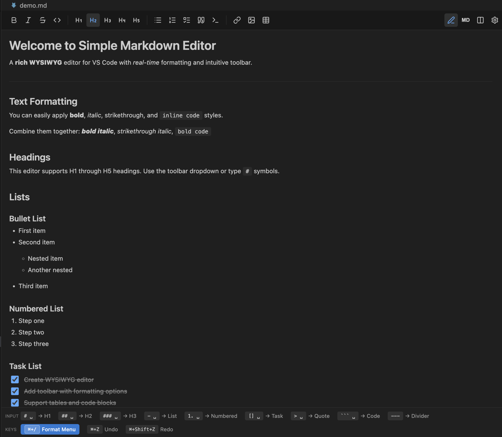
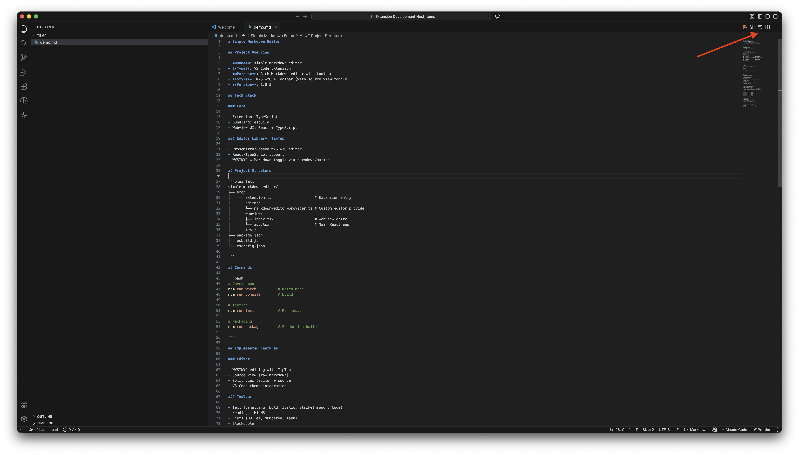
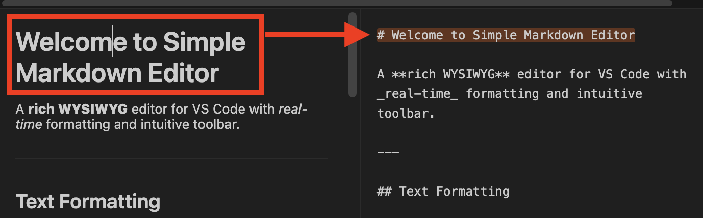
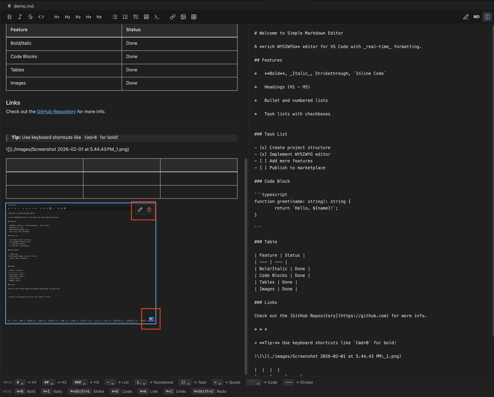
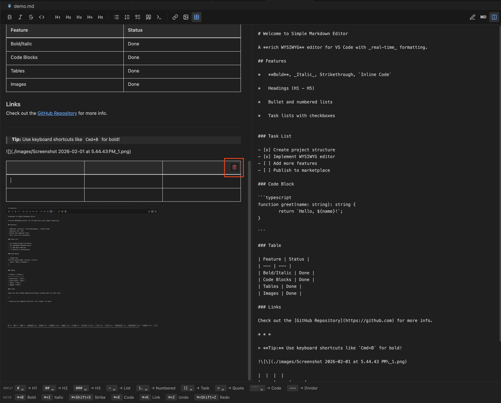
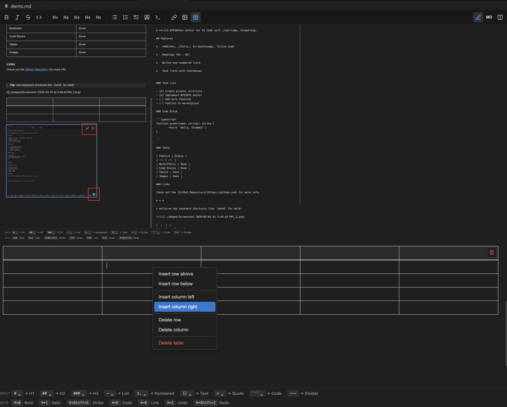
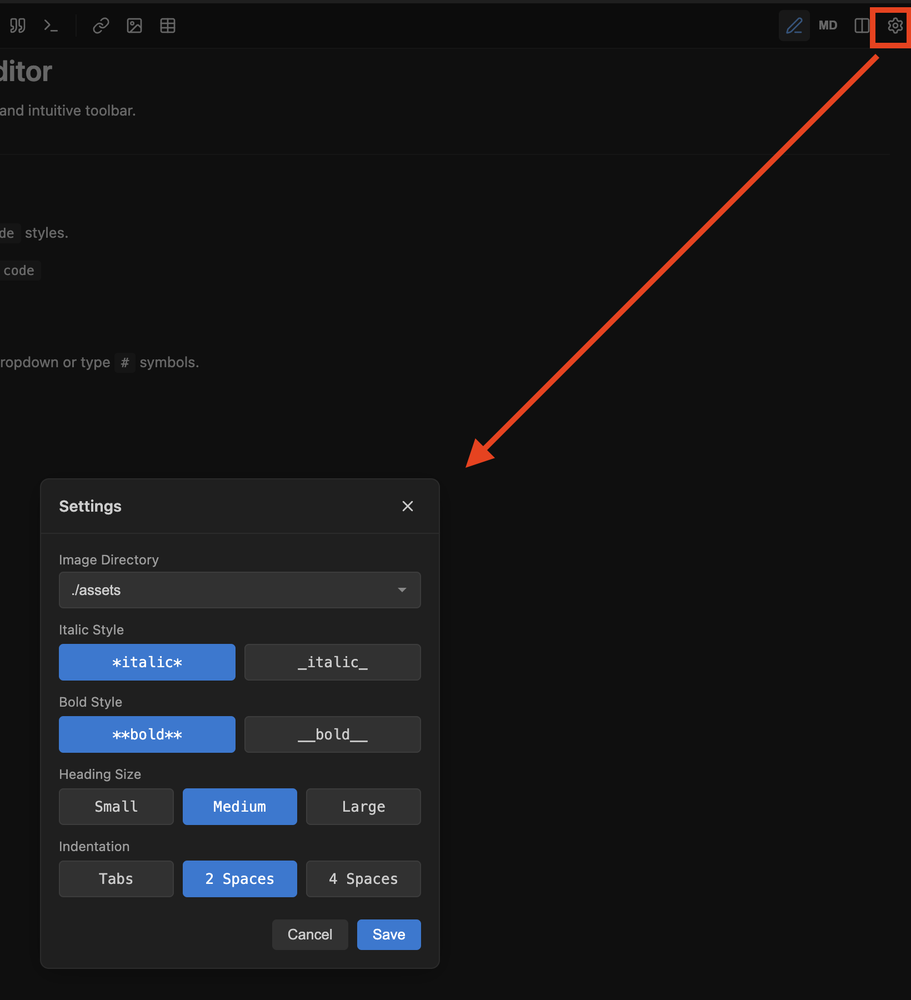
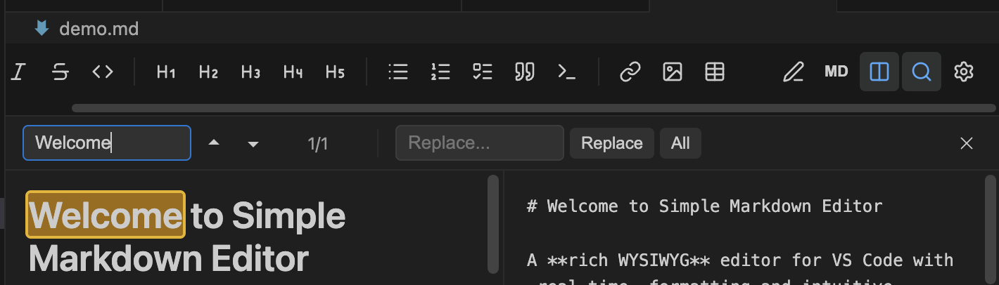

# Simple Markdown Editor

A rich WYSIWYG Markdown editor for VS Code with a modern toolbar interface.



## How to Open

- **Right-click on .md file** → "Open with Simple Markdown Editor" from context menu
- **Title bar button** → Click the button in the top-right corner when viewing a Markdown file



## Features

### WYSIWYG Editing

Edit Markdown files visually with real-time formatting. No need to memorize syntax.

### Toolbar

Full-featured toolbar with quick access to:

- **Text formatting**: Bold, Italic, Strikethrough, Inline Code
- **Headings**: H1 through H5
- **Lists**: Bullet, Numbered, and Task Lists
- **Blocks**: Blockquote, Code Block
- **Media**: Links, Images, and Tables

### View Modes

- **Editor**: WYSIWYG editing mode
- **Source**: Raw Markdown source editing
- **Split**: Side-by-side editor and source view with block highlight sync



### Code Blocks

Syntax highlighting for 20+ programming languages with a language selector dropdown.

### Task Lists

Interactive checkboxes for task lists. Click to toggle completion.

### Images

- Drag & drop images from your file system
- Paste images from clipboard (auto-saved to workspace)
- Resize images by dragging the corner handle
- Edit or delete images via floating menu



### Links

- Insert links via toolbar or keyboard shortcut
- Hover to preview URL with open/edit options
- File path autocomplete when typing

### Tables

- Insert tables via toolbar
- Right-click context menu for row/column operations
- Selection outline when focused





### Settings

Customize your editing experience via the settings panel (gear icon in toolbar):

- **Heading Size**: Small, Medium, or Large
- **Indentation**: Tabs, 2 Spaces, or 4 Spaces
- **Image Directory**: Choose where images are saved
- **Markdown Style**: Italic and bold delimiter preferences

Settings are automatically saved and persist across sessions.



### Find & Replace

Full-featured search and replace functionality:

- Search with match highlighting in both Editor and Source views
- Navigate between matches with Previous/Next buttons
- Replace current match or Replace All
- Match count display (e.g., "3/15")
- Keyboard shortcuts: `Cmd/Ctrl+F` to open, `Enter` for next, `Shift+Enter` for previous, `Escape` to close



## Keyboard Shortcuts

| Shortcut               | Action                                 |
| ---------------------- | -------------------------------------- |
| `Cmd/Ctrl + B`         | Bold                                   |
| `Cmd/Ctrl + I`         | Italic                                 |
| `Cmd/Ctrl + F`         | Find & Replace                         |
| `Cmd/Ctrl + /`         | Format Menu (Link, Strike, Code, etc.) |
| `Cmd/Ctrl + Z`         | Undo                                   |
| `Cmd/Ctrl + Shift + Z` | Redo                                   |

## Input Rules

Type these patterns followed by a space to quickly format:

| Pattern      | Result          |
| ------------ | --------------- |
| `# `         | Heading 1       |
| `## `        | Heading 2       |
| `### `       | Heading 3       |
| `- `         | Bullet list     |
| `1. `        | Numbered list   |
| `[] `        | Task list       |
| `> `         | Blockquote      |
| ` ``` `      | Code block      |
| `---`        | Horizontal rule |

## Requirements

- VS Code 1.75.0 or higher

## License

MIT
